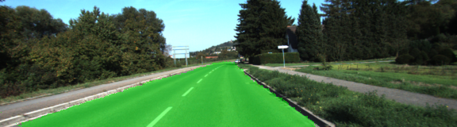
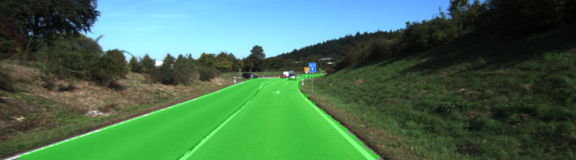
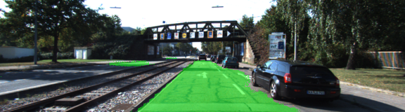
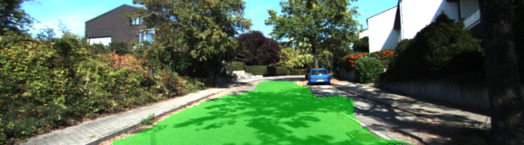

# Semantic Segmentation
### Introduction

This project implements a Fully Convolutional Network (FCN) for scene understanding. It learns to classify road and not road at the per-pixel level. Implemented in Tensorlfow.

##### Network

The FCN is composed of two parts, the convolutional part which functions as a classifier and a deconvolutional part that upsamples the results to the desired image size. The image classifier used here was the vgg16 network without its fully connected layers. The last convolutional layer was instead transformed via a 1x1 convolution and upsampled. Skip connections between prior convolutional layers were also added at each deconvolutional step. See the architecture below from this paper [Fully Convolutional Networks for Semantic Segmentation](https://people.eecs.berkeley.edu/~jonlong/long_shelhamer_fcn.pdf).

##### Training
The entire network including any updates to the vgg component on the [Kitti Road dataset](http://www.cvlibs.net/datasets/kitti/eval_road.php) from [here](http://www.cvlibs.net/download.php?file=data_road.zip) on a GTX1080. A batch size of 16 image was used for 40 epochs. However after just 30 epochs the mean cross entropy loss leveled off and early stopping could have been used. No image augmentation was used and might help however, the FCN paper above suggest it would not help dramatically. Final mean loss was about .035.

##### Results

The full set of result images can be found here:

[Results](https://github.com/cochoa0x1/semantic-segmentation/releases/tag/v1.0.0)

Here are some of results

